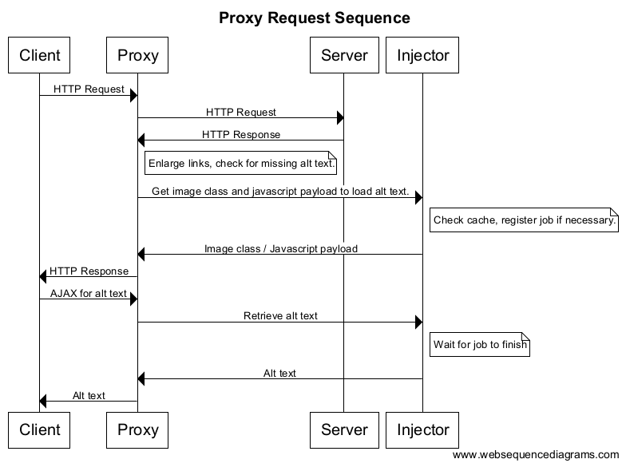
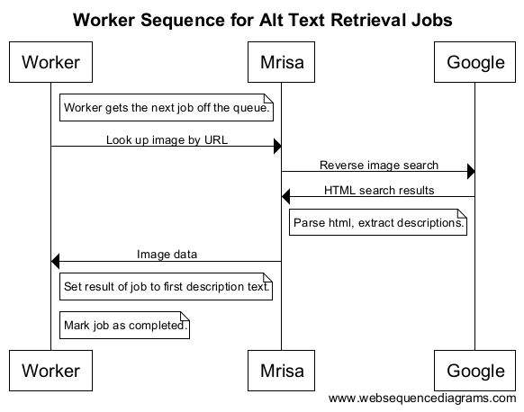

Jay DeStories and Jared Bronen 
@jwde and @jbronen 
COMP 112 - Fall 2015

#Building an Efficient HTTP Proxy for Accessibility

For our final project, we chose to design and implement an HTTP proxy primarily designed for use by people with disabilities. We wrote our proxy in python and implemented the following features:
<ol>
<li>Reverse image alt-text generation: we inject JavaScript on pages containing images without alt-text and asynchronously perform reverse image search using a Google service. The JavaScript then fetches results from the proxy. We then parse the results to return the first description of the image.</li>
<li>Link magnification: We implemented a magnification system to increase the size of links by altering the styling of HTML pages for increased ease of use.</li>
<li>Performance
  <ol><li>Image Caching: We developed a system to store image paths and their respective alt-texts in a cache for performance benefits.</li>
  <li>JavaScript Injection: We developed a system to asynchronously process alt-text requests so the majority of the page could load without waiting for the process to complete.</li>
  </ol></li></ol>

###Reverse Image Alt-Text Generation

Before serving HTML content, we scan the document for images without alt-text using regular expressions. If we find any, we assign a special class to the image, and inject JavaScript into the page to asynchronously request the alt-text using AJAX, and then add it to the alt field in the image itself. If the image does not exist in our cache, we use cURL to process a reverse-image search to Google. We then use Beautiful Soup to parse the results and return the first description, which is added to an alt field within the image by the injector.

Many visually impaired users use screen readers, such as WebbIE on Windows or the Fang extension for Firefox, to view text-only versions HTML documents. While many popular, large-scale websites include the alt tag, which replaces image on many of these screen readers, many websites with user-generated content, such as tumblr or WordPress, contain images without any alt-text. This tool aims to make those websites, as well as any others that contain images without alt-text more accessible.

###Link Magnification
We use regular expressions to scan through the HTML document looking for anchor tags and increase the font size in the styling.
This feature is useful for both persons with visual disabilities as well as kinetic, such as Parkinson's Disease, who may have trouble clicking links with default font sizes.

###Performance
<ol><li><h4>Image Caching</h4>

To reduce the amount of cURL calls to Google's reverse image lookup service, we implemented a cache that evicts the least frequently accessed (LFA) image url with its corresponding alt-text.  
Each cache entry consists of a tuple of an image url and its corresponding injector job as well as a certain number of points (starting at 10). Whenever an operation is performed on the cache, the system depreciates all points values in the cache by multiplying all points values by 0.9 for every 10 second interval that has passed. 
Items in the cache get 1 point when the corresponding image/job is either injected or retrieved. 
We use a minheap to keep track of points, evicting the item with the smallest points value when we need to make space. Our current cache size is set to 1000 items.

</li>
<li><h4>JavaScript Injector</h4>

We quickly noticed that our main obstacle in performance was the reverse image lookup. A naive implementation of our project used no JavaScript injection; instead, it processed requests before loading the page itself, leading to delays approximate 5 to 15 seconds.
  
As demonstrated in our diagram below, we use JavaScript to fetch alt-text from the proxy. For this reason, we recommend using our proxy with screen readers that support JavaScript, such as WebbIE and Fang.

</li></ol>
<h3>Conclusion</h3>

We were able to design and implement a fast, reliable HTTP proxy to aid people visual and kinetic disabilities.

<h3>Figures</h3>

